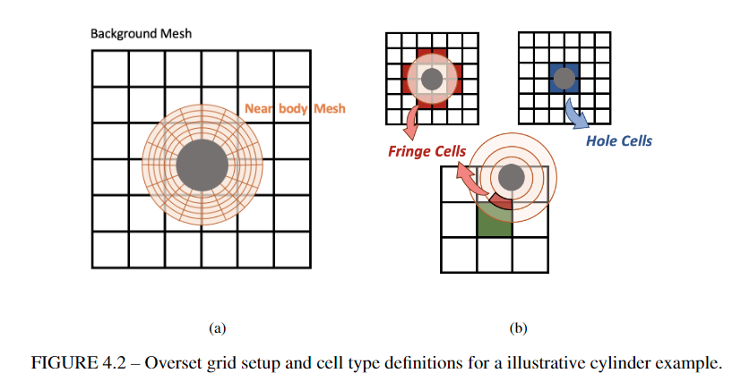
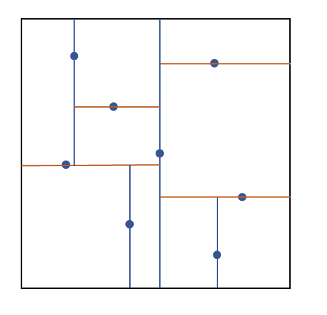
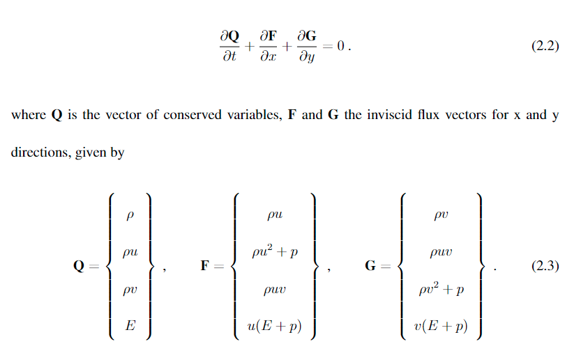
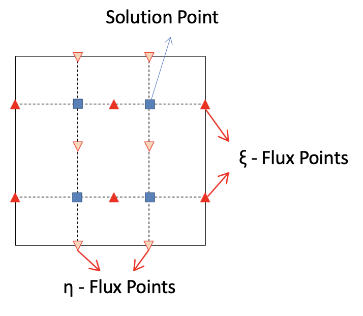
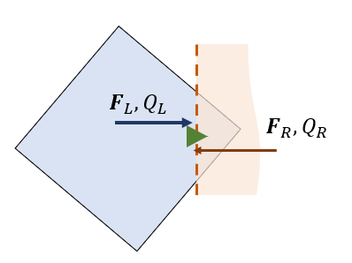

# Masters Thesis Code Repository

This repository contains the code and documentation for my Masters Thesis. The project focuses on high-order flux reconstruction methods for unsteady flows over complex geometries, particularly in the context of overset grids.

## Description

The project implements a high-order flux reconstruction solver coupled with a high-order conservative interpolation approach and a kd-tree algorithm for data communication in overset regions. The flow is modeled by the 2-D Euler equations discretized in space using the Spectral Differences method and an explicit strong stability-preserving Runge-Kutta scheme for time integration.

## Documentation

Detailed documentation about the implementations and methodologies used in this project can be found in the [`masters_thesis_renan_santos.pdf`](./docs/masters_thesis_renan_santos.pdf) file. Key implementation points include:

### Overset Assembly

- **Fringe and Hole Cells**: Fringe cells receive, communicate, and process data during solver iterations, while hole cells are skipped.
  <p align="center" >
    
  </p>

- **Geometric Search**: Defines receptor-donor relationships to communicate data from cells in the background mesh to nodes over the external boundary in the near-body mesh. This includes the hole-cutting process to remove fully overlapped cells from solver iterations and a kd-tree implementation on both meshes.
  <p align="center" >
    
  </p>

### Numerical Formulation

- **Euler Equations**: Models compressible, non-heat-conducting, inviscid flows using conservation laws of mass, momentum, and total energy.
  <p align="center" >
    
  </p>

- **Spectral Difference Method**: High-order space discretization method that transforms each cell from its physical domain to a computational domain, allowing high-order solution interpolation.
  <p align="center" >
    
  </p>

- **Flux Reconstruction**: Uses a Riemann solver to reconstruct the normal flux at cell interfaces, ensuring conservation properties through the cells' interface and interpolation between the overset region.
  <p align="center" >
    
  </p>

### Boundary Conditions

- **Slip Wall**: Assumes fluid slips around surfaces with no boundary layer formation.
- **Inlet and Outlet**: Different conditions for supersonic and subsonic flows, ensuring proper wave propagation and information dependency.
- **Non-Reflective Farfield**: Imposes characteristics using Riemann invariants to approximate the 1D local solution for the characteristic problem normal to the boundary walls.

### Validation Cases

You can find all use cases setup in [`src/cases`](./src/cases) and their results well detailed in my Masters thesis [`masters_thesis_renan_santos.pdf`](./docs/masters_thesis_renan_santos.pdf).

See below the main use cases:

- Airfoil flow
- Inviscid cylinder flow
- Implosion flow
- Overset cases (cylinder and vortex)
- Ringleb flow
- Isentropic inviscid vortex flow

## Project Structure

```

.gitignore
docs/
include/
resources/
src/
tests/
thirdparty/
CMakeLists.txt

```

### Directories

- **include/**: Header files for the project.
- **resources/**: Additional resources for the project.
- **src/**: Source code for the project.
- **src/cases**: Source code for all validation cases used in the project (airfoil, cylinder, implosion, overset, ringleb and vortex).
- **tests/**: Unit tests for the project.
- **thirdparty/**: Third-party libraries used in the project.

## Building the Project

To build the project, you need to have CMake and a C++ compiler installed. Follow these steps:

1. **Generate build files:**

   ```sh
   cmake -S . -B build
   ```

2. **Build the project:**
   ```sh
   cmake --build build
   ```

## Running Tests

The project uses Catch2 for unit testing. To run the tests, execute the following command after building the project:

```sh
ctest --test-dir build
```

## Key Components

### Source Code

The main source code is located in the [`src`](./src) directory. Key components include:

- **Element.cpp**: Implementation of elements.
- **Field.cpp**: Implementation of fields.
- **Ghost.cpp**: Implementation of ghost elements.
- **Mesh.cpp**: Implementation of the mesh.
- **Node.cpp**: Implementation of nodes.
- **Poly.cpp**: Implementation of polynomial functions.
- **SD.cpp**: Implementation of spectral difference methods.
- **Time.cpp**: Implementation of time-stepping methods.
- **Weights.cpp**: Implementation of weight calculations.

### Header Files

Header files are located in the [`include`](./include) directory. Key headers include:

- **Dict.h**: Dictionary utilities.
- **DVector.h**: Vector utilities.
- **Element.h**: Element definitions.
- **Field.h**: Field definitions.
- **Ghost.h**: Ghost element definitions.
- **Helpers.h**: Helper functions.
- **Mesh.h**: Mesh definitions.
- **Node.h**: Node definitions.
- **Poly.h**: Polynomial function definitions.
- **SD.h**: Spectral difference method definitions.
- **Time.h**: Time-stepping method definitions.
- **Weights.h**: Weight calculation definitions.

### Tests

Unit tests are located in the [`tests`](./tests) directory. The main test file is [`tests/main.cpp`](./tests/main.cpp), which includes the Catch2 main function.

### Third-Party Libraries

Third-party libraries are located in the [`thirdparty`](./thirdparty) directory. The project uses Catch2 for unit testing, located in [`thirdparty/catch/catch.hpp`](thirdparty/catch/catch.hpp).

## Contact

For any questions or issues, please contact [Renan Santos] at [renanufabc@gmail.com].

This README provides an overview of the project structure, build instructions, and key components. For more detailed information, refer to the [`masters_thesis_renan_santos.pdf`](./docs/masters_thesis_renan_santos.pdf) file and comments within the source code.
